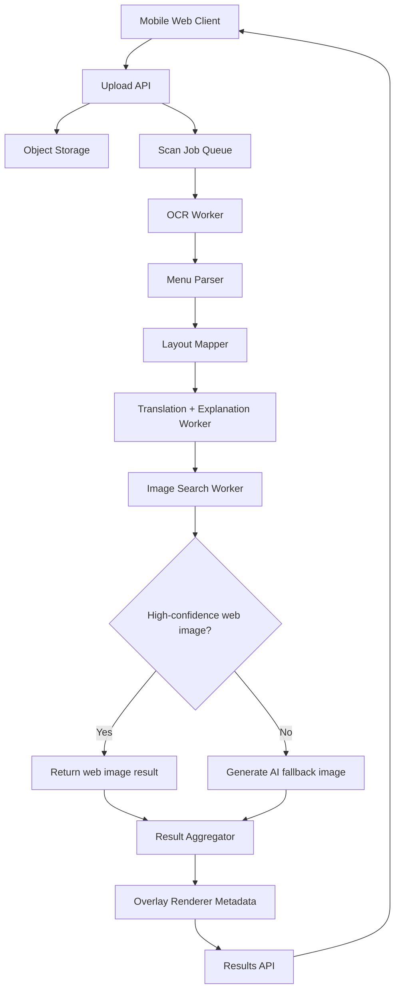

# Menu Vision Technical Architecture

## Scope

This architecture is for V1 of a mobile-first webapp that takes an English-language menu photo, translates menu items into Simplified Chinese, explains each dish, and shows a broad-web representative image with AI fallback.

## Architecture Goals

- fast first working version
- high OCR reliability for dense menus
- preserve original menu layout when confidence is high
- clear separation between upload, OCR, interpretation, and image stages
- easy observability and fallback handling
- low operational complexity for an MVP

## Recommended Stack

### Frontend

- Next.js App Router
- TypeScript
- Tailwind CSS with CSS variables
- PWA manifest and install support

### Backend

- Next.js route handlers for MVP
- background job queue for asynchronous scan processing
- structured JSON responses for deterministic rendering

### Infrastructure

- Vercel for web hosting
- object storage such as Cloudflare R2 for image uploads
- Redis or managed queue for jobs and short-lived cache
- Postgres for scans, items, and analytics if persistence is needed beyond anonymous local history

### External Services

- OCR: Google Cloud Vision `DOCUMENT_TEXT_DETECTION`
- translation and dish explanation: LLM with structured output
- broad web image retrieval: Google Custom Search JSON API
- generated fallback image: OpenAI image generation API
- analytics: PostHog or similar product analytics

## High-Level Flow



## User Flow to System Flow

1. User captures or uploads a menu photo.
2. Client compresses the image before upload.
3. Client requests a signed upload target.
4. Image is uploaded directly to object storage.
5. Client creates a scan job referencing the uploaded image.
6. Backend processes OCR and parsing.
7. Layout mapper preserves dish positions, bounding boxes, and likely reading order.
8. LLM layer normalizes dish names and translates to Chinese.
9. Image worker searches broad web results for matching dish visuals.
10. If confidence is low, image generation creates an illustrative fallback.
11. Results are persisted briefly and returned to the client with both list and overlay metadata.

## Frontend Architecture

### Primary Routes

- `/` landing page
- `/scan` camera/upload flow
- `/results/[scanId]` results page
- `/history` optional local or account-backed scan history later

### Client State Buckets

- capture state
- upload state
- processing state
- scan result state
- user edits state
- settings state such as target language

### Frontend Modules

- camera capture component
- upload component
- image crop/enhance component
- progress state component
- result list and dish card components
- overlay renderer and positioned chip components
- dish detail sheet
- OCR correction editor
- analytics hooks

## Backend Services

### 1. Upload Service

Responsibilities:

- issue signed upload URLs
- validate mime type and file size
- generate upload key and scan token

Suggested endpoint:

- `POST /api/uploads/sign`

### 2. Scan Orchestrator

Responsibilities:

- create scan record
- enqueue processing job
- expose scan status

Suggested endpoints:

- `POST /api/scans`
- `GET /api/scans/:id`

### 3. OCR Worker

Responsibilities:

- submit image to OCR provider
- collect full text and bounding boxes
- preserve OCR confidence metadata
- preserve block-level geometry for layout reconstruction

Output:

- raw OCR document model
- line blocks
- confidence metrics

### 4. Menu Parser

Responsibilities:

- split menu content into candidate items
- pair likely price with dish lines
- infer category sections when possible
- remove decorative text noise
- classify likely dish name, description, price, and section header blocks

### 5. Layout Mapper

Responsibilities:

- preserve relative block positions from OCR output
- attach each parsed dish to a bounding box anchor
- produce overlay-safe placement hints for translated labels and image thumbnails
- estimate layout confidence to decide overlay mode vs list fallback

Output example:

```json
{
  "sourceLanguage": "en",
  "items": [
    {
      "sourceText": "Fish and Chips",
      "priceText": "$18"
    }
  ]
}
```

### 6. Translation and Explanation Worker

Responsibilities:

- translate English dish names to Simplified Chinese
- provide plain-language description
- infer likely ingredients and preparation style
- note ambiguity and confidence
- return strict schema output

Output example:

```json
{
  "translatedName": "炸鱼薯条",
  "explanation": "英式炸鱼配薯条，常见搭配是塔塔酱。",
  "possibleIngredients": ["white fish", "potato", "flour batter"],
  "ambiguityNotes": [],
  "confidence": 0.92
}
```

### 7. Image Search Worker

Responsibilities:

- query Google image results using normalized dish name
- include optional cuisine hints and city/restaurant context if available
- rank results by semantic fit and image usefulness
- store top candidate and alternatives

Ranking signals:

- dish-name match
- snippet/title match
- domain quality
- image size/resolution
- cuisine-context match

### 8. AI Fallback Image Worker

Responsibilities:

- generate a realistic representative image when web search confidence is low
- label output as illustrative only
- avoid implying exact restaurant provenance

### 9. Result Aggregator

Responsibilities:

- combine OCR, layout, translation, and image outputs
- compute overall per-item confidence and layout confidence
- normalize response for UI rendering in both list mode and overlay mode

## Data Model

### Scan

```json
{
  "id": "scan_123",
  "status": "completed",
  "imageKey": "uploads/2026/04/08/abc.jpg",
  "sourceLanguage": "en",
  "targetLanguage": "zh-CN",
  "itemCount": 12,
  "overallConfidence": 0.84,
  "createdAt": "2026-04-08T20:15:00Z"
}
```

### ScanItem

```json
{
  "id": "item_1",
  "scanId": "scan_123",
  "originalText": "Chicken Fried Steak",
  "translatedName": "炸鸡排风味牛排",
  "explanation": "美国南方菜，通常是裹粉牛排油炸后搭配肉汁。",
  "possibleIngredients": ["beef steak", "flour coating", "gravy"],
  "priceText": "$21",
  "layout": {
    "x": 0.12,
    "y": 0.34,
    "w": 0.42,
    "h": 0.08,
    "layoutConfidence": 0.82
  },
  "imageType": "web",
  "imageUrl": "https://...",
  "imageSourcePageUrl": "https://...",
  "confidence": 0.73,
  "ambiguityNotes": ["Name is misleading: dish is beef, not chicken."]
}
```

## API Contract Sketch

### Create Signed Upload

`POST /api/uploads/sign`

Request:

```json
{
  "contentType": "image/jpeg",
  "sizeBytes": 1820391
}
```

Response:

```json
{
  "uploadUrl": "https://storage.example.com/...",
  "imageKey": "uploads/2026/04/08/abc.jpg"
}
```

### Create Scan

`POST /api/scans`

Request:

```json
{
  "imageKey": "uploads/2026/04/08/abc.jpg",
  "targetLanguage": "zh-CN"
}
```

Response:

```json
{
  "scanId": "scan_123",
  "status": "queued"
}
```

### Poll Scan Result

`GET /api/scans/scan_123`

Response:

```json
{
  "scanId": "scan_123",
  "status": "completed",
  "sourceLanguage": "en",
  "overallConfidence": 0.84,
  "items": []
}
```

### Rerun Selected Items

`POST /api/scans/scan_123/rerun-items`

Request:

```json
{
  "items": [
    {
      "itemId": "item_1",
      "editedText": "Chicken Fried Steak"
    }
  ]
}
```

## Confidence Model

Per-item confidence should combine:

- OCR confidence
- parse confidence
- translation confidence
- image confidence
- layout confidence

Suggested weighting for V1:

- OCR: 0.30
- parse: 0.20
- translation/explanation: 0.30
- image: 0.20

## Error Handling Strategy

### Upload Errors

- unsupported type
- file too large
- network interruption

Response:

- stay on capture flow
- show retry CTA
- preserve local preview

### OCR Errors

- unreadable text
- low-confidence multiline extraction

Response:

- offer crop-and-rerun
- enable manual text correction
- return partial text if available

### Image Search Errors

- zero results
- irrelevant results
- blocked source URL

Response:

- use AI fallback
- show provenance label clearly

### LLM Errors

- malformed schema
- timeout
- low confidence explanation

Response:

- retry once with stricter schema prompt
- fall back to translation-only response if needed

## Privacy and Retention

- uploaded images should expire automatically unless user chooses to save
- scan results can be cached for short-term retrieval
- local history should default to on-device storage for anonymous users
- avoid collecting location unless explicitly added later for restaurant context

## Observability

Track:

- upload success/failure
- OCR latency and confidence
- translation latency
- image hit rate from web search
- AI fallback rate
- time to first rendered result
- correction frequency per scan

## Deployment Plan

### Phase 1

- monolithic Next.js app
- route handlers for upload and scan APIs
- background jobs using hosted queue
- object storage for images

### Phase 2

- split workers if traffic grows
- add durable database records
- add rate limiting and abuse protection
- add CDN optimization for result images

## Build Order Recommendation

1. scaffold Next.js app with mobile landing and scan routes
2. implement upload and mocked scan pipeline
3. build results UI against mock structured JSON
4. connect real OCR
5. connect translation/explanation worker
6. connect Google image retrieval
7. connect AI fallback image generation
8. add OCR correction rerun flow

## Engineering Risks

- English menu text may still include decorative layout that confuses parsing
- broad web image results can be semantically close but visually misleading
- overlay label placement can collide on dense menus if geometry heuristics are weak
- per-item image lookup can dominate latency if not parallelized and cached
- dish explanations may overstate confidence if prompts are not tightly constrained

## Recommendation

For the first build, keep the architecture modular but deploy it as one app. That keeps shipping speed high while preserving clear boundaries between OCR, interpretation, and imagery.
